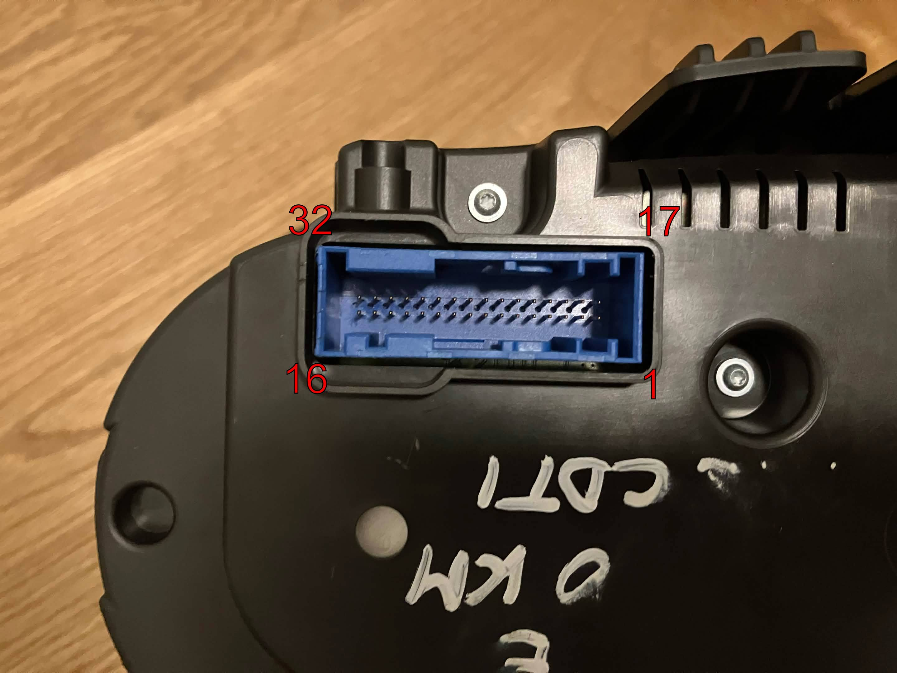

### Wiring for Opel Corsa E cluster
First begin by wiring your CAN interface/ESP32 board - see the main readme for details. Then follow the below instructions:

Below is the connector pinout for the Opel Corsa E cluster:

Since the cluster uses GMLAN instead of regular CAN-bus, it only has one dedicated pin to receive data. The GMLAN pin gets connected to CAN H pin of your CAN-bus interface, whereas CAN L gets connected to ESP GND. 

Connect the cluster's GND to ESP GND together so that the CAN-bus interface works correctly.

Wire everything according to the tables below:

| Cluster pin | Connect to | Comment |
|--|--|--|
| 3 | GMLAN | CAN-bus interface: Connect CAN H to GMLAN pin, and CAN L to ESP GND
| 7 | +12V | Permanent battery voltage |
| 8 | +12V | Ignition signal |
| 19 | GND | Connect cluster GND with ESP GND |
| 9 | Optional: Driver information center menu signal | Short to pin 13 to switch menus |
| 14 | Optional: Driver information center switch signal | Connect to pin 13 with a resistor: 600 Ohms = Menu up, 1'800 Ohms = Menu down, 3'300 Ohms = Set/Clear